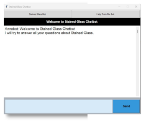

# Stained Glass Chatbot

## Summary
When you are first learning a hobby, you have a lot of questions. Some go to classes, some go to books, and some go online to find answers.  The problem arises when a student goes home from a class or reads a book or blog, they still have questions. This chatbot is aimed to help consolidate a lot of questions the user may have into a learning environment where the chatbot can help answer those questions.

## Built With
Python, tkinter, sklearn, tensorflow, nltk, json, pickle